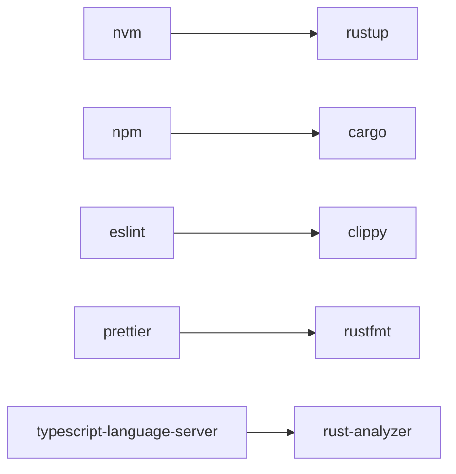

# 21-Setup

## Tools



### rustup

```shell
# nvm install stable
rustup install stable
```

### cargo

```shell
# npm init
cargo init
cargo new

# npm test
cargo install foo

# npm test
cargo test

# npm publish
cargo publish

# npm run start
cargo run

# npm run benchmarks
cargo bench

# npm run build
cargo build

# npm run clean
cargo clean

# npm run docs
cargo doc
```

## Workspaces & monorepos

> Cargo.toml (package.json)

```toml
[workspace]
members = [
  "crates/*"
]

[dependencies]
foo = "0.1.0"
```

## Addition Tools

- cargo-expand
  ```
  cargo install cargo-expand
  ```

## VSCode

https://code.visualstudio.com/docs/languages/rust

## VSCode Extensions

- `CodeLLDB`: https://marketplace.visualstudio.com/items?itemName=vadimcn.vscode-lldb
  > A native debugger powered by LLDB. Debug C++, Rust and other compiled languages.
- `Even Better TOML`: https://marketplace.visualstudio.com/items?
  > Fully-featured TOML support
- `Rust Analyzer`: https://marketplace.visualstudio.com/items?itemName=RustAnalyzer.rust-analyzer
