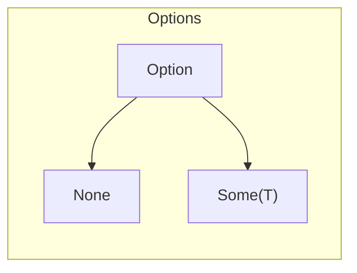
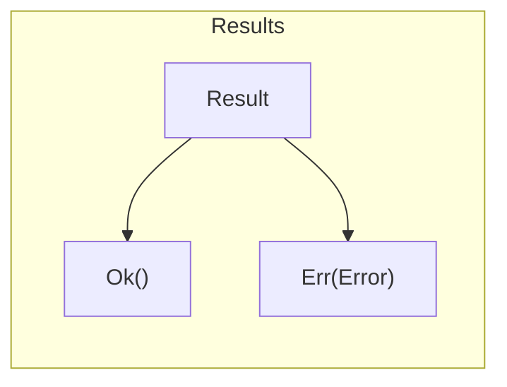

# learn-rs

## 🦀 Let's learn Rust together!

1. Frontend `Alice` want to build web app. // `main`, todomvc, yew
1. Backend `Bob` want to build api for Alice. // `lib`, actix
1. React Frontend `Cat` want to build `wasm` to use with `ReactJS`. // `wasm`, `wasm-bindgen`
1. SmartContract Developer `Dog` want to build smart contract. // `solana`, `anchor`
1. Artist `Elephant` want to create `NFT`. // `metaplex`, `sugar`
1. Trainer `Fox` want to create ticket `NFT`. // `cardinal`
1. Attendee `Giraffe` want to use rented `NFT` as ticket. // `cardinal`
1. Platform Owner `Hippo` want to make a subscription model. // `cadinal`
1. Bot Developer `Iguana` want to build chatbot. // `discord`, `wasm`, `cloudflare`
1. Data Analyst `Jaguar` want to read price data from oracle. // `Dune`
1. Data Engineer `Kiwi` want to extract data from contract. // `Pyth`, `explorer`
1. Data Scientist `Lion` want to build and deploy model. // `tensorflow`, `wasm`

## Base

1. Setup: `vscode`, `cargo`, main/lib/workspace.
1. Hello World: crate, run, debug.

## R5

1. variable: string, vec, ref, mut.
1. method: fn, println, json, `serde`.
1. condition: if, match.
1. loop: iter, map, filter, collect.
1. conversions: cast, from, into, try_into, unwrap/?.
1. error: concept, expect, handling, `anyhow`(main).

## R4

1. hashmap, bigint, decimals, `lazy_static`.
1. method: derive, cast with enum, `serde`, `borsh`, closure.
1. condition: match, enum.
1. loop: enumerate, filter_map.
1. conversions: down casting.
1. error: handling loop error, `thiserror`(lib).

## R3

1. lifetime, box, dyn.
1. custom struct, module, Value, JsValue.
1. async: fetch via `reqwest`, `tokio`.
1. error: custom error.
1. wasm: `wasm-bindgen`, via `firebase`, via `cloudflare`.
1. deploy: `cloud run`, github action.

## R2

1. rc, arc, refcall, heap, stack.
1. future.
1. create `API`.
1. create `TODO-MVC`.
1. `solana`: read account, `pyth`.
1. non-blocking: cloudflare.

## R1

1. mutex.
1. macro.
1. `solana`: read/write `counter`, cpi.
1. `anchor`: read `tulip`, `friktion`.
1. `tensorflow`.

## Review

1. 📚 A half-hour to `READ` Rust: https://fasterthanli.me/articles/a-half-hour-to-learn-rust
1. 🎮 Explore rust with playground: https://tourofrust.com/
1. 📚 Easier to read compare with doc: https://dhghomon.github.io/easy_rust/Chapter_1.html
1. 🎮 Fill in the blank quiz: https://github.com/sunface/rust-by-practice
1. 🎮 Feel like fixing bugs: https://github.com/rust-lang/rustlings

## Path

