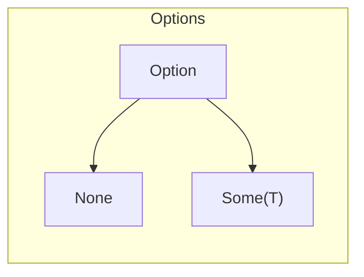
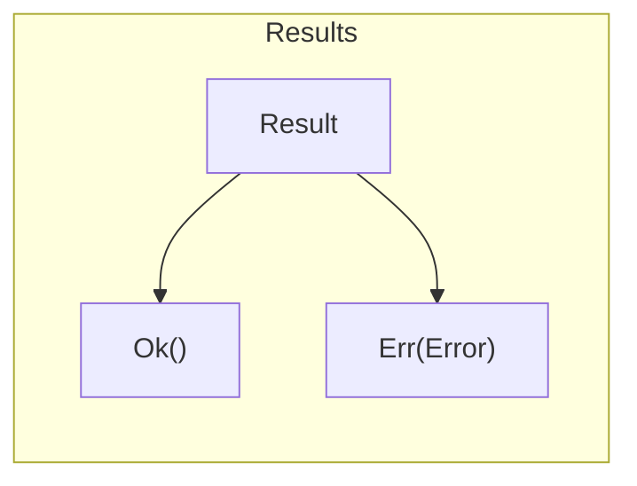

# learn-rs

🦀 Let's learn Rust together!

# Basic

1. 📚 A half-hour to `READ` Rust: https://fasterthanli.me/articles/a-half-hour-to-learn-rust
1. 🎮 Explore rust with playground: https://tourofrust.com/
1. 📚 Easier to read compare with doc: https://dhghomon.github.io/easy_rust/Chapter_1.html
1. 🎮 Fill in the blank quiz: https://github.com/sunface/rust-by-practice
1. 🎮 Feel like fixing bugs: https://github.com/rust-lang/rustlings

# Advance

1. TODO

# Path

